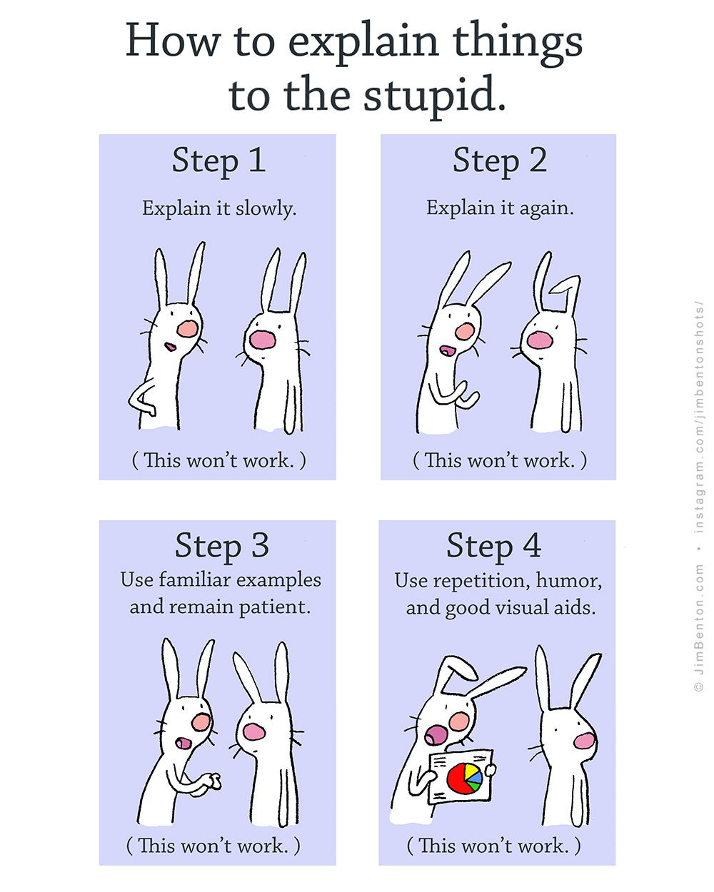

% My Notebook
% myself
% today


--------------------------------------------------------------------------------

```python
import matplotlib as mpl
print(mpl.rcParams['figure.dpi'])
mpl.rcParams['figure.dpi'] = 300
print(mpl.rcParams['figure.dpi'])
mpl.rcParams['savefig.dpi'] = 300
```

``` python
import matplotlib.pyplot as plt
plt.plot([1, 2, 3])
```

``` python
import matplotlib.pyplot as plt
plt.plot([1, 2, 3])
```

# Lorem ipsum

**Lorem ipsum** dolor sit amet, consectetur adipiscing elit. Nunc luctus
bibendum felis dictum sodales.

```
print("hello")
```

```
print("hello")
```

```python
print("hello")
```

## Result

``` python
>>> 1 + 1
```

## Pyout

```
from IPython.display import HTML
HTML("""
<script>
console.log("hello");
</script>
<b>HTML</b>
""")
```

## Image {.tag key=value #ididid}

This image  will be included as a cell attachment.


--------------------------------------------------------------------------------

```
1 + 1
```

```
print("Hello world!")
```

$$
\int_0^x f(t) \, dt
$$

sljdksjdksdj $a=1$


```
width = 345.0 / 72.27
height = width / (16/9)
print(width, height)
plt.figure(figsize=(width, height))
plt.plot([0, 2, 1, 0, 3])
```